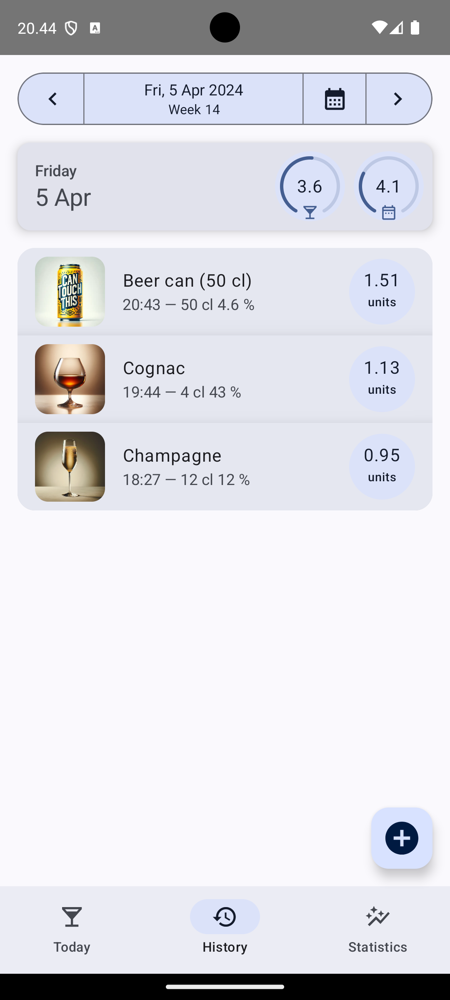

# Kaljakello (Beer Clock)

This repo contains the implementation of a multiplatform (Android + iOS)
mobile app for tracking blood alcohol concentration based on recorded
alcohol consumption. It can be used to give you an estimate for how long
it takes for your body to clear out the remaining alcohol. Please note
that the app can only calculate an estimation based on the generally
available alcohol calculation formulas. For more accurate results you
must use a proper blood alcohol measuring tool.

This project is based on the Jetpack Compose Multiplatform project, and
it has been created from their
[project template](https://github.com/JetBrains/compose-multiplatform-template).

<p align="center" width="100%">
<br />
<i>Illustration courtesy of DALL-E 3 via Bing<br />
Prompt: dark and moody image of a beer glass as a clock with the time slowly ticking away</i>
</p>

Read the [project diary](./diary/README.md) for some description in
how the project was setup.

## App screenshots

<p align="center" width="100%">


<br />
</p>

## Supported platforms and minimum required OS level

- Android 8.0 Oreo (API level 26)
    - Cumulative usage 2023/12: `94.9 %`
    - Required to get datetime functions from `java.time`
- iOS 14.1
    - Cumulative usage 2023/12: `95.4 %`
    - Required by Compose Multiplatform

## Libraries

BeerClock is based on the latest Compose Multiplatform release (as of development).
When updating versions, see the version compatibility
[notes](https://www.jetbrains.com/help/kotlin-multiplatform-dev/compose-compatibility-and-versioning.html#limitations-of-compose-multiplatform-releases).

BeerClock uses [SQLite](https://www.sqlite.org/index.html) as the database
to store the drink data. For Android, the SQLite backend is replaced with
[requery](https://github.com/requery/requery) to get a newer version.

The SQLite version installed:

- Android: 3.43.0 (from requery)
- iOS: supplied by platform (cumulative usage 2023/12):
    - iOS 17.0: 3.39.5 (4.9 %)
    - iOS 16.0: 3.39.0 (82.4 %)
    - iOS 15.0: 3.36.0 (92.9 %)
    - iOS 14.1: 3.32.3 (95.4 %, project build target)
- Minimum SQLite version: `3.32.3`

## Troubleshooting

See the [troubleshooting](./diary/Troubleshooting.md) documentation for
common errors and some workarounds when developing with Compose
Multiplatform.

## Development

To verify that SQL migration files create the same schema as the .sq files, you can run:

```bash
./gradlew verifySqlDelightMigration
```

To run all tests, you can run:

```bash
./gradlew check
```

To run instrumented tests on a running Android emulator, fire up the emulator and run:

```bash
./gradlew :composeApp:connectedAndroidTest
```
